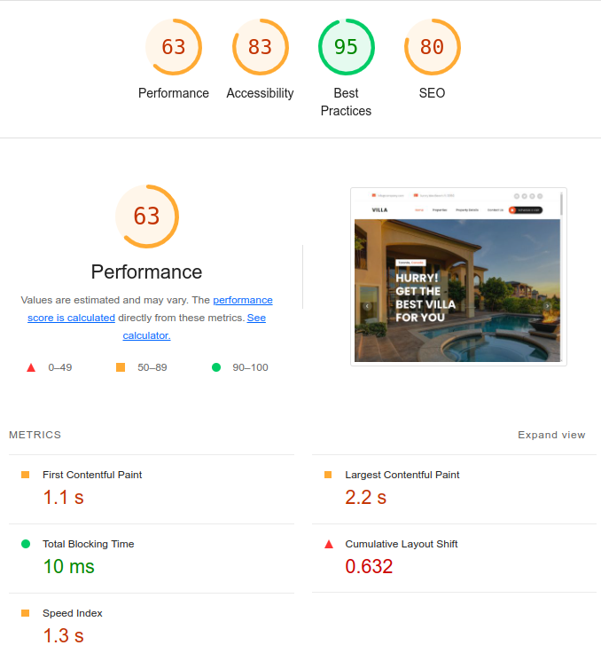
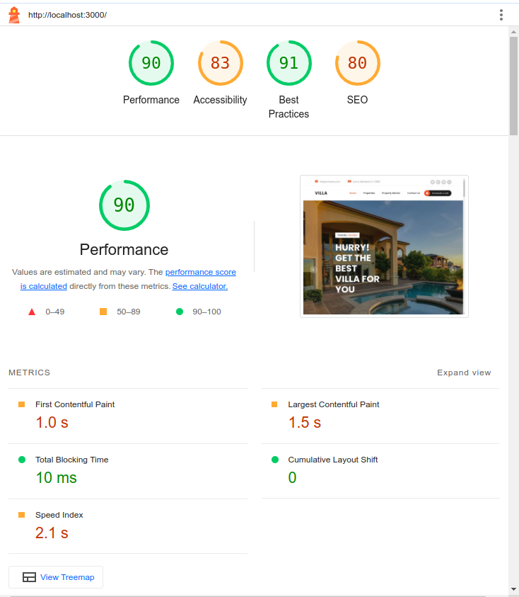

## Changes made:

1. Added compression
2. Minify html, css and js
3. Give image tags width and height
4. Remove unused css
5. Replaced jpg and png with webp

## before


## after


How to run:
```
npm install
npm run build
cd server
npm install
node index.js
```
